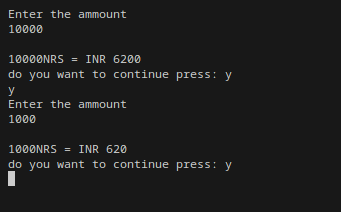
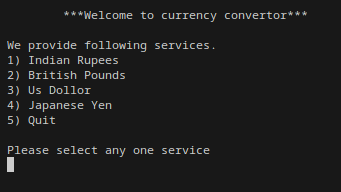

# This is the college project 3rd semester.

- Name: Currency convertor
- Author: Amrit pandey

#What i learned from this projects
- to solve buffer issue.
- to use logic with ascii values.
- to remove remote file of dir in git.
